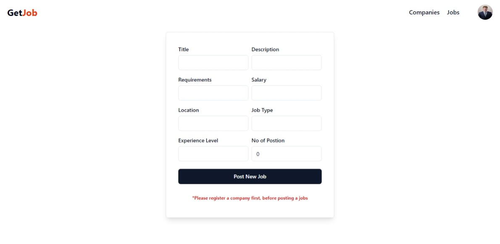

  <h1>Welcome to GetJob - Your Ultimate Job Portal</h1>

  GetJob is your go-to destination for discovering exciting career opportunities and connecting with top companies. Whether you're a job seeker or an employer, GetJob offers a seamless platform to meet your needs.

<h2 align="left">For Job Seekers </h2>

- **Browse Jobs:** Explore job listings across various industries and locations.
- **Apply with Ease:** Submit applications effortlessly and track their status.
- **Profile Management:** Create a professional profile to showcase your skills and experience.

<h2 align="left">For Employers </h2>

- **Post Job Listings:** Advertise your job openings to a vast pool of candidates.
- **Application Management:** Streamline your hiring process with our easy-to-use system.
- **Company Profile:** Highlight your company culture and attract top talent.

  👉 <a href="https://getjob1.vercel.app/"  >Live Demo</a>

<h3 align="left">Tech Stack:</h3>

  - MongoDB  
  - Express 
  - Node JS 
  - React JS

<h2 align="center">Screenshots of the Project 📸</h2>

<h3 align="center">Home Page 🏡</h3>

  

<h3 align="center">Signup Page 🎁</h3>

  

<h3 align="center">All jobs 👇</h3>

  

<h3 align="center">Job Description 👇</h3>

  

<h2 align="center">Admin Section 📸</h2>

<h3 align="center">Create Job 👇</h3>

  

